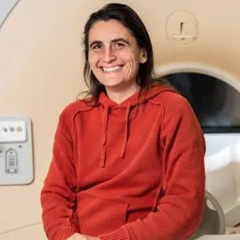

# Social Brain Lab

Valeria Gazzola

Christian Keysers

## Focused ultrasound imaging
- [Processing of functional and anatomical ultra sound imaging data](https://github.com/Herseninstituut/fUSI-Analysis)

- [SBL fUSI](https://github.com/Herseninstituut/SBL_FUSI)

- [fUSI tools](https://github.com/Herseninstituut/fUSI-tools)

## (f)MRI
- [R implementation of Representational Similarity Analysis](https://github.com/Herseninstituut/RSA) (work in progress)

- [Running `fslview` in a docker container](https://github.com/Herseninstituut/fslview_in_a_box)

- [R/Shiny app to explore dimensionality reduction on (f)MRI results](https://github.com/Herseninstituut/neuroimaging_dimred)

- [R + Python analysis of layer fMRI data](https://github.com/Herseninstituut/layerfMRI)

- [DCM analysis on rs-fMRI from the ABIDE dataset](https://github.com/Herseninstituut/ASD_DCM_subcortex_sensory)

- [Custom Atlases for specific (f)MRI analyses](https://github.com/Herseninstituut/Atlases-Neuroimaging)

- [Resting-state functional connectivity analyses on the ABIDE dataset](https://github.com/Herseninstituut/rsfnc)

## EcOG
- [Action Prediction EcOG scripts](https://github.com/Csaramon/ActionPredictionECoG)# SBL_NIN
